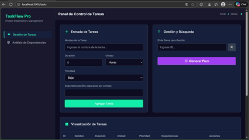
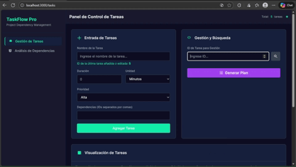
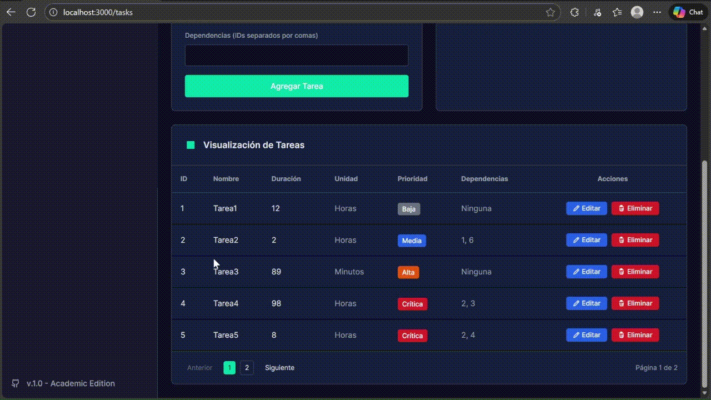
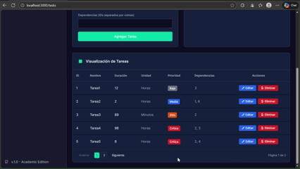

# 🚀 TaskFlow Pro - Sistema de Planificación de Tareas

<div align="center">
  
  
  
  <br><br>
  
  <h3>UNIVERSIDAD NACIONAL DE COLOMBIA</h3>
  <h4>Facultad de Ingeniería</h4>
  <h4>Asignatura: Estructuras de Datos</h4>
  <p>2025-2</p>
</div>

---

## 😁 Autores


- **Ever Nicolás Muñoz Cortés** - *evmunoz@unal.edu.co*
- **Brayan Camilo Gamba Herrera** - *bgambah@unal.edu.co*
- **Manuel Federico Castro Suárez** - *mcastrosu@unal.edu.co*


**Docente**: Jhon Alexander López Fajardo

---

## 📋 Descripción del Proyecto

**TaskFlow Pro** es un sistema avanzado de gestión y planificación de proyectos que implementa el método de la **Ruta Crítica (CPM)**. A diferencia de herramientas comerciales, este motor ha sido construido **desde cero** implementando estructuras de datos fundamentales en Python, sin depender de librerías externas para la lógica.

El sistema permite:
- **Modelar Proyectos Complejos**: Definir tareas con duración, prioridad y dependencias múltiples.
- **Análisis en Tiempo Real**: Detección instantánea de ciclos y validación de integridad del grafo.
- **Visualización Interactiva**: Interfaz moderna con modo oscuro para explorar el grafo de dependencias.
- **Optimización de Recursos**: Cálculo automático de la ruta crítica y ordenamiento topológico basado en prioridades.

---

## 📂 Estructura del Proyecto

El proyecto sigue una arquitectura moderna de cliente-servidor:

```
Proyecto_DS/
├── client/                 # Frontend (React + Vite + Tailwind)
│   ├── components/         # Componentes UI (InteractiveGraph, Sidebar)
│   └── pages/              # Vistas (TaskManagement, CriticalPathAnalysis)
├── server/                 # Backend (FastAPI)
│   └── backend/
│       ├── api.py          # Endpoints de la API
│       └── structures/     # 🧠 IMPLEMENTACIÓN DE ESTRUCTURAS DE DATOS
│           ├── custom_graph.py
│           ├── custom_hash_table.py
│           ├── custom_heap.py
│           ├── custom_queue.py
│           ├── custom_set.py
│           └── custom_stack.py
└── docker-compose.yml      # Orquestación de contenedores
```

---

## 🏗️ Estructuras de Datos Implementadas

Hemos renunciado a las implementaciones estándar de Python (como `dict`, `set`, `heapq`) para demostrar el dominio de los conceptos de la asignatura.

### 🧱 Estructuras Lineales

#### 1. [CustomStack (Pila)](server/backend/structures/custom_stack.py)
- **Concepto**: LIFO (Last In, First Out).
- **Implementación**: Lista Enlazada Simple con puntero `top`.
- **Complejidad**: $O(1)$ para `push`/`pop`.
- **Aplicación**: Fundamental para el algoritmo de **Ordenamiento Topológico** y manejo de recursión.

#### 2. [CustomQueue (Cola)](server/backend/structures/custom_queue.py)
- **Concepto**: FIFO (First In, First Out).
- **Implementación**: Lista Enlazada con punteros `front` y `rear`.
- **Complejidad**: $O(1)$ para `enqueue`/`dequeue`.
- **Aplicación**: Motor del algoritmo **BFS** para cálculo de niveles y paralelismo.

### 🌳 Estructuras No Lineales

#### 3. [CustomHashTable (Tabla Hash)](server/backend/structures/custom_hash_table.py)
- **Concepto**: Mapeo clave-valor de alta velocidad.
- **Implementación**: Arreglo dinámico con resolución de colisiones por **Encadenamiento (Chaining)**.
- **Complejidad**: $O(1)$ promedio.
- **Aplicación**: "Base de datos" en memoria para almacenar nodos y tareas por ID/Nombre.

#### 4. [CustomGraph (Grafo Dirigido)](server/backend/structures/custom_graph.py)
- **Concepto**: Red de nodos y aristas dirigidas.
- **Implementación**: **Lista de Adyacencia** sobre nuestra `CustomHashTable`.
- **Aplicación**: Modelo matemático del proyecto. Detecta ciclos y calcula rutas.

#### 5. [CustomSet (Conjunto)](server/backend/structures/custom_set.py)
- **Concepto**: Colección de elementos únicos.
- **Implementación**: Wrapper sobre `CustomHashTable`.
- **Aplicación**: Control de visitados en DFS/BFS y detección de ciclos (conjuntos de colores).

#### 6. [CustomHeap (Montículo)](server/backend/structures/custom_heap.py)
- **Concepto**: Árbol binario para acceso rápido al elemento de mayor prioridad.
- **Implementación**: Max-Heap sobre arreglo dinámico.
- **Complejidad**: $O(\log n)$.
- **Aplicación**: Algoritmo de Kahn modificado para priorizar tareas críticas cuando hay múltiples opciones ejecutables.

---

## 🧠 Algoritmos Aplicados

### 🔍 DFS (Depth-First Search) - Detección de Ciclos
Recorrido en profundidad utilizando el paradigma de **tres colores** (Blanco, Gris, Negro) para identificar "back-edges".
- **Resultado**: Garantiza que el grafo sea un DAG (Grafo Acíclico Dirigido) antes de procesarlo.

### 📏 Topological Sort - Planificación
Linealización del grafo. Si la tarea A depende de B, B aparecerá antes que A en la lista.
- **Variante**: Implementamos una versión que utiliza `CustomHeap` para desempatar tareas disponibles según su **Prioridad** (Crítica > Alta > Media > Baja).

### 🌊 BFS (Breadth-First Search) - Niveles
Recorrido por capas para determinar la "profundidad" de cada tarea y agrupar aquellas que pueden ejecutarse en paralelo.

---

## ✨ Características Principales

- **Modo Oscuro**: Interfaz diseñada para largas sesiones de trabajo, con paleta de colores "Cyberpunk/Pro".
- **Validación Robusta**: Impide la creación de dependencias inválidas o cíclicas en tiempo real.
- **Persistencia Local**: Los datos del proyecto se guardan en el navegador para no perder trabajo al recargar.
- **Visualización Cytoscape**: Grafo interactivo con soporte para zoom, arrastre y selección de nodos.

---

## 🚀 Instalación y Ejecución

### Opción A: Docker (Recomendada 🐳)
Despliegue completo en un solo comando.

1.  **Clonar el repositorio**:
    ```bash
    git clone https://github.com/nicolasmcort/Proyecto_DS.git
    cd Proyecto_DS
    ```
2.  **Iniciar**:
    ```bash
    docker-compose up --build
    ```
3.  **Acceder**:
    - App: [http://localhost:3000](http://localhost:3000)
    - API Docs: [http://localhost:8000/docs](http://localhost:8000/docs)

### Opción B: Ejecución Manual

#### Backend (Python 3.11+)
```bash
cd server/backend
python -m venv venv
# Windows: venv\Scripts\activate | Mac/Linux: source venv/bin/activate
pip install -r requirements.txt
uvicorn api:app --reload --port 8000
```

#### Frontend (Node.js 18+)
```bash
cd client
npm install
npm run dev
```

---

## 📖 Guía de Uso

### 1. Gestión de Tareas
Define tus tareas en el panel principal. Asigna prioridades y dependencias.


### 2. Visualización y Edición
Busca, edita o elimina tareas existentes.



### 3. Generación del Plan
El sistema analizará el grafo. Si es válido, mostrará la visualización interactiva y la ruta crítica.


### 4. Detección de Errores
Si creas un ciclo (ej. A depende de B, y B depende de A), el sistema lo detectará y te impedirá generar un plan inválido.


---

## 🛠️ Stack Tecnológico

| Componente | Tecnología | Descripción |
|------------|------------|-------------|
| **Backend** |  | Lógica core y estructuras de datos. |
| **API** |  | Framework web de alto rendimiento. |
| **Frontend** |  | Librería de UI. |
| **Build Tool** |  | Entorno de desarrollo frontend ultrarrápido. |
| **Estilos** |  | Framework de CSS utilitario. |
| **Container** |  | Orquestación de contenedores. |

---

<div align="center">
  <p>Hecho con ❤️ y mucho ☕ para la UNAL</p>
</div>
